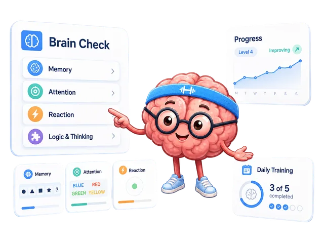

# BEAPP Practice Kit

A small companion for [Brain Exercise App](https://brainexerciseapp.com/).
Choose a short session, understand the exercise, and keep a note of your result.

**[Open the planner and journal](https://yantm.github.io/beapp-practice-kit/)**
· [Read the practical guide](guide.md)
· [Open BEAPP Daily Training](https://brainexerciseapp.com/daily-brain-training/)



## Start in three steps

1. Choose **2, 5, or 8 minutes**, then a skill area or “A bit of everything.”
2. Open the first exercise on BEAPP. Read its rules and finish an attempt.
3. Copy the result into your manual journal. Include the difficulty, device,
   and input method so that your next comparison is useful.

Times are planning estimates, including reading the instructions.
Finish at a comfortable pace and take a break when you need one.

Prefer a ready-made session? Open
[Daily Training](https://brainexerciseapp.com/daily-brain-training/).
Want an introduction to the skill areas? Start with
[Brain Check](https://brainexerciseapp.com/brain-check/).

## What the kit includes

- A short-session planner with memory, attention, reaction, and thinking choices.
- Plain-English steps for eight exercises.
- A downloadable seven-day CSV plan. Each day is optional.
- A manual browser-local journal with CSV export.
- A zero-dependency JavaScript utility for other small planning tools.

The exercises run on **brainexerciseapp.com**. This kit stores only the
results you enter yourself. It does not import or change your app history.

## Use it without installing anything

Open the live planner above. To use the kit offline, download the
**beapp-practice-kit-v1.0.0.zip** release, unzip it, and open **index.html**.
The planner, instructions, and CSV exports work locally.
Opening an exercise still requires access to BEAPP.

The kit does not include analytics or send journal entries to a server.
Entries are stored in this browser's local storage. Clearing site data,
changing browsers, or using private browsing can remove access to them.
Export CSV to keep a copy. If storage is unavailable, the page tells you
to export temporary entries before leaving.

## Read results fairly

Compare the **same exercise, difficulty, device, and input method**.
Read accuracy alongside speed when both are shown. Record interruptions
or early clicks in your notes. The kit keeps each exercise's units separate
and does not combine them into an overall score.

Results describe performance in specific tasks. This kit is a planning and
note-taking tool, not a medical assessment or a promise of changes in
everyday abilities. [How BEAPP results are calculated](https://brainexerciseapp.com/how-results-are-calculated/).

## JavaScript usage

Node.js 20 or newer is required only for development and the utility API.
No Node.js installation is needed to open the browser kit.

```js
const { createSession, createWeek, resultsToCsv } = require('./planner.js');
const session = createSession({ minutes: 5, focus: 'memory' });
console.log(session.tasks.map(task => task.name));
const week = createWeek({ startDate: '2026-10-06', minutes: 5, focus: 'mixed' });
const csv = resultsToCsv([{
  date: '2026-10-06', task: 'reaction', value: 240,
  condition: 'same difficulty · laptop · mouse', notes: 'no early clicks'
}]);
```

API reference: [API.md](API.md).
Dates use YYYY-MM-DD; the seven-day schedule uses UTC calendar arithmetic.
CSV export quotes text and protects against spreadsheet formula interpretation.

## Development

```sh
npm run check
npm test
```

Tests cover planning choices, date boundaries, result units, validation,
and CSV handling. Pull requests run the **Quality gate** workflow.
There is no build step and no runtime dependency.

## License

New utility code and documentation are MIT licensed.
BEAPP logos, mascot artwork, and skill icons have separate
[brand asset terms](assets/NOTICE.md).
